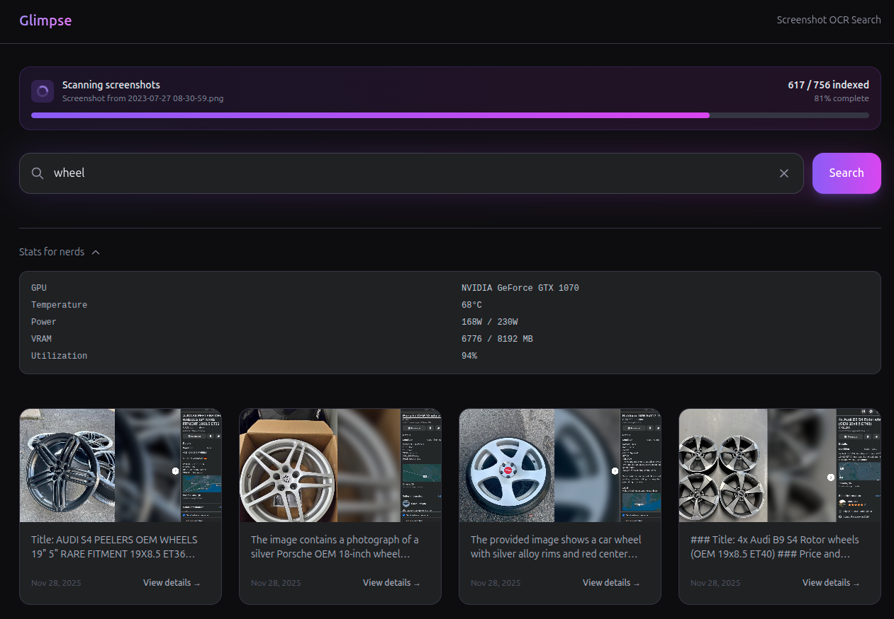

# Glimpse

[](https://github.com/cillierscharl/glimpse/actions/workflows/ci.yml)
[](LICENSE)
[](https://dotnet.microsoft.com/)
[](https://docs.docker.com/compose/)

Never lose a screenshot again. Watches, indexes, and lets you search your screen captures by text content.



## Requirements

- Docker with NVIDIA Container Toolkit (for GPU acceleration)
- NVIDIA GPU with drivers installed

## Quick Start

```bash
git clone https://github.com/cillierscharl/glimpse.git
cd glimpse
SCREENSHOTS_PATH="$HOME/Pictures/Screenshots" docker compose up -d
```

Open http://localhost:5123

The first run downloads the minicpm-v vision model (~5GB) and starts indexing your screenshots.

## Features

- **Auto-watch** - Monitors your screenshot folder for new images
- **Local OCR** - Extracts text using minicpm-v vision model (fully offline)
- **Search** - Find screenshots by text content or date
- **Tags** - Organize screenshots with custom tags
- **Notes** - Add personal notes to screenshots
- **Real-time** - New screenshots are prioritized and indexed immediately

## How It Works

1. Watches your screenshot directory for new images
2. Extracts text using minicpm-v vision model (via Ollama)
3. Stores text and metadata in SQLite with full-text search
4. Web UI lets you search by content or date (e.g., "Nov 26", "error message")

## Monitoring (Optional)

Run with Prometheus, Grafana, and Loki for metrics and log aggregation:

```bash
SCREENSHOTS_PATH="$HOME/Pictures/Screenshots" METRICS_ENABLED=true docker compose --profile monitoring up -d
```

- Grafana: http://localhost:3000 (admin/admin)
- Prometheus: http://localhost:9090

## Architecture

See [architecture/](architecture/) for PlantUML diagrams of the system design.

## Privacy

All processing happens locally. Screenshots never leave your machine.

## License

[MIT](LICENSE)
